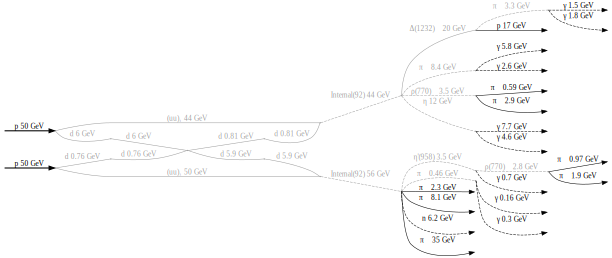

# pyhepmc
<!-- begin of description -->
A Pythonic wrapper for the HepMC3 C++ library.
<!-- end of description -->

pyhepmc was formerly known as pyhepmc-ng. The development of pyhepmc-ng continues in the pyhepmc package.

<!-- begin of description -->
HepMC3 has its own Python bindings. Why should you use these?

**pyhepmc is easy to install**

The command `pip install pyhepmc` just works on all common platforms. Since we publish binary wheels, you don't need to compile anything. Since we include the HepMC3 library, you don't need to install it separately either.

However, building from source is also easy. External software is not required. Just download the repository with `git clone --recursive` and run `pip install -v -e .`.

**pyhepmc is Pythonic and Jupyter notebook-friendly**

pyhepmc is a hand-crafted mapping of C++ code to Python. It supports Python idioms
where appropriate. The classes are designed to render well in Jupyter notebooks.

- C++ methods which act like properties are represented as properties,
  e.g. GenParticle::set_status and GenParticle::status are mapped to a single
  GenParticle.status field in Python
- Tuples and lists are implicitly convertible to FourVectors
- Vectors of objects on the C++ side are mapped to Python lists
- ReaderAscii and WriterAscii support the context manager protocol
- A convenient `open` function is provided for reading and writing HepMC files

**pyhepmc supports visualizations powered by graphviz**

pyhepmc can optionally visualize events, using the mature graphviz library as a backend.

**pyhepmc is actively maintained**

pyhepmc is part of the Scikit-HEP project, which aims to provide all tools needed by particle physicists to do data analysis in Python. There is also official collaboration with the HepMC3 project.

**pyhepmc is unit tested**

We aim for 100% coverage, not quite there yet.

## Documentation

pyhepmc currently has no separate documentation, but it mirrors the C++ interface of the HepMC3 library, which is documented here: http://hepmc.web.cern.ch/hepmc. Docs will come soon, for now, please use Python's `help()` browser to learn about the API.
<!-- end of description -->

## License

pyhepmc is covered by the BSD 3-clause license, see the `LICENSE` file for details. This license only applies to the pyhepmc code. The connected external libraries HepMC3 and pybind11 are covered by other licenses, as described in their respective `LICENSE` files.
