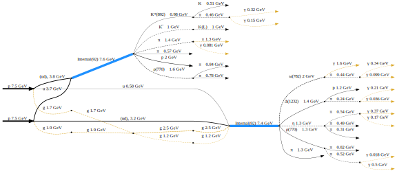

pyhepmc
=======

A Pythonic wrapper for the `HepMC3 C++ library <http://hepmc.web.cern.ch/hepmc>`_.

.. image:: https://scikit-hep.org/assets/images/Scikit--HEP-Project-blue.svg
  :target: https://scikit-hep.org

.. image:: https://badge.fury.io/py/pyhepmc.svg
  :target: https://pypi.org/project/pyhepmc

.. image:: https://coveralls.io/repos/github/scikit-hep/pyhepmc/badge.svg?branch=main
  :target: https://coveralls.io/github/scikit-hep/pyhepmc?branch=main

.. image:: https://zenodo.org/badge/DOI/10.5281/zenodo.7013498.svg
  :target: https://doi.org/10.5281/zenodo.7013498

pyhepmc was formerly known as pyhepmc-ng. The development of pyhepmc-ng continues in the pyhepmc package.

HepMC3 has its own Python bindings. Why should you use these?

**pyhepmc is easy to install**

The command ``pip install pyhepmc`` just works on all common platforms. Since we publish binary wheels, you don't need to compile anything. Since we include the HepMC3 library, you don't need to install it separately either.

However, building from source is also easy. External software is not required. Just download the repository with ``git clone --recursive`` and run ``pip install -v -e .``.

**pyhepmc is Pythonic and Jupyter notebook-friendly**

pyhepmc is a hand-crafted mapping of C++ code to Python, `see documentation for details <https://scikit-hep.org/pyhepmc/reference.html>`_. Python idioms are supported where appropriate. The classes are designed to render well in Jupyter notebooks. IO is simplified. Events can be visualized in Jupyter notebooks.

**pyhepmc supports visualizations powered by graphviz**

pyhepmc can optionally visualize events, using the mature `graphviz <https://graphviz.org>`_ library as a backend.

**pyhepmc is actively maintained**

pyhepmc is part of the Scikit-HEP project, which aims to provide all tools needed by particle physicists to do data analysis in Python. It is developed in close collaboration with the HepMC3 project.

**pyhepmc is thoroughly unit tested**

We have 100% coverage for the Python API.

Documentation
-------------

pyhepmc largely mirrors the C++ interface of the `HepMC3 library, which is documented here <http://hepmc.web.cern.ch/hepmc>`_. Parts of the documentation have been copied from HepMC3. Documentation is available as Python docstrings, so you can use Python's ``help()`` browser to learn about the API. Alternatively, you can consult `the online reference generated from these docstrings <https://scikit-hep.org/pyhepmc/>`_ which includes some examples.

License
-------

The pyhepmc code is covered by the BSD 3-clause license, but its main functionality comes from bundled software which is released under different licenses. The HepMC3 library is licensed under LGPL-v3 and bundles other software which is released under different licenses. See the files ``LICENSE`` and ``LICENSE_bundled`` in the source directory for details.
